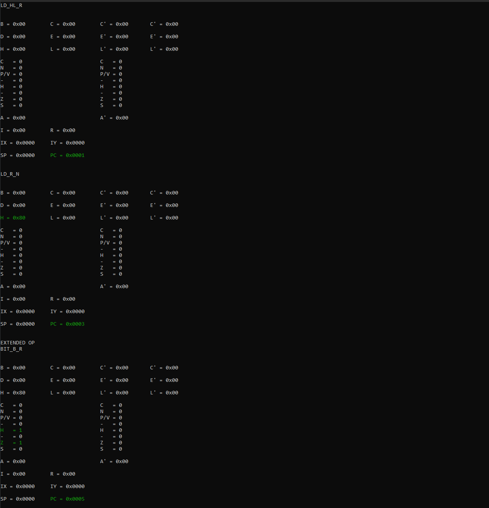

# Z80CPU

Эмулятор 8-разрядного микропроцессора [Zilog Z80](https://ru.wikipedia.org/wiki/Zilog_Z80).

---

## Характеристики 
- Наличие шести 8-рязрядных регистров общего назначения(РОН) доступные по отдельности
и в парах(образуя, тем самым, 16-битную регистровую пару), аккумулятора, флагового регистра.
- Наличие вспомогательного блока РОНов, аккумулятора, флагового регистра.
- 6 специальных регистров.
- Возможность адресации до 64Кб памяти.
- 158 базовых команд.
- Наличие четырёх форматов команд (1-, 2-, 3- и 4-байтного).
- Развитая система прерываний(3 режима + немаскируемые прерывания).

## Технологии

- Boost Interprocess(для отображения объектного файла программы для Z80 в адресное пространство эмулятора).
- Win32 API(для обозначения регистров, изменненных после выполнения команды процессором). 

## API справка

**init(z80Cpu)**

Инициализировать 16-битные пары РОНов.Запустить процессор.

**execute(z80Cpu)**

Выполнить 1 машинную команду. Включает в себя выборку(**fetch(z80Cpu)**)
и декодирование(**evaluate(unsigned int opcode, T\* table, size_t tableSize, size_t& index)**).

**registersDump(z80Cpu)**

Выполнить дамп регистров.

## Пример

## На данный момент
- Создана структура для последующей работы.
- Реализована загрузка и декодирование 1- и  2- байтных команд.
- Реализованы некоторые базовые команды из различных групп(загрузка регистров, безуслоный переход, вызов подпрограмм и.т.д).
- Создан простой отладчик, отображающий содержимое регистров и подсвещиюващий измененные значения.

## Планы
- Добавить поддержку ввода/вывода.
- Реализовать механизм виртуальной памяти.
- Улучшить отладчик.

## Список источников
- https://justinmeiners.github.io/lc3-vm/index.html#1:9
- http://igorkov.org/pdf/Z80-Central-Processor-Unit.pdf

 [В начало](#Z80CPU)
---

